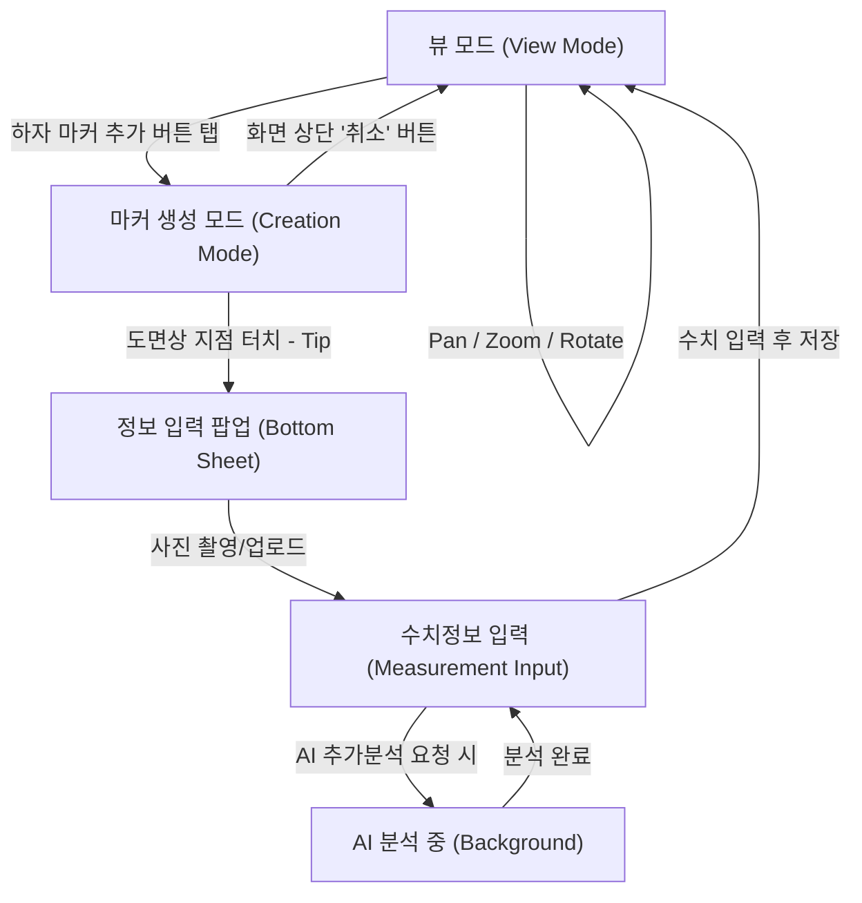
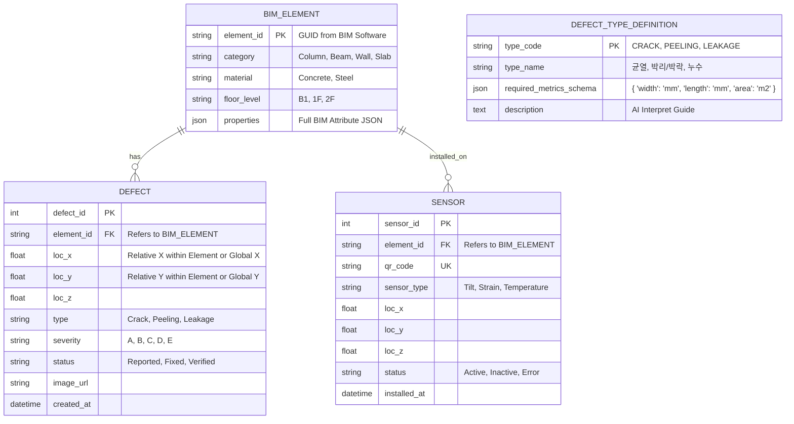

# 🏗️ AI & BIM 기반 시설물 안전진단 플랫폼 구축 기획서 ver2

**Date:** 2026-01-08
**Version:** 1.0
**Author:** AI Service Architect (Antigravity)

---

## Section 1. 앱 UX 흐름도 (User Flow)

현장 작업자의 사용성을 극대화하기 위해 **Zero-Depth**와 **Mode-Based Interaction** 원칙을 적용한 UX 흐름입니다.

### 1.1 [뷰 모드] ↔ [생성 모드] 전환 프로세스

### 1.2 상세 시나리오
1.  **현장 선택**
    *   조사할 현장 프로젝트를 선택 -> 층별/건물 단위 도면 선택.(해당 도면은 WEB에서 BIM으로 변환된 2D 벡터 도면)
2.  **초기 상태 (View Mode):**
    *   사용자는 BIM 도면을 자유롭게 조작합니다. 오터치를 방지하기 위해 이 상태에서는 터치해도 마커가 생성되지 않습니다.
3.  **모드 진입 (Mode Transition):**
    *   우측 하단 FAB(Floating Action Button) 또는 상단 툴바의 **'하자 마커 추가'** 버튼을 누릅니다.
    *   **UI 변화:** 상단 네비게이션 바가 **[생성 모드]**로 변경되며, "하자가 발생한 위치를 도면에서 선택해주세요"라는 안내 토스트(Toast) 메시지가 뜹니다. 도면 외곽에 녹색/파란색 보더라인이 생겨 현재가 '입력 모드'임을 시각적으로 강조합니다.
4.  **지점 선택 (Point Selection):**
    *   사용자가 도면의 특정 위치를 탭(Tap)합니다.
    *   탭한 위치에 일시적인 **핀(Pin) 애니메이션**이 떨어지며 좌표가 고정됩니다.
5.  **입력 팝업 및 촬영 (Instant Capture):**
    *   마커 생성 직후, 별도의 조작 없이 **즉시 카메라 화면**이 전면에 활성화됩니다.
    *   사진 촬영 후 확인을 누르면 바로 **수치 입력 모드**로 전환됩니다.
6.  **정보 및 수치 입력 (Detail Input):**
    *   **입력 방식:** 사진 위에 펜으로 숫자를 쓰거나(Handwriting), 키패드 입력 중 편한 방식을 선택합니다.
    *   **러프 입력(Rough Input):** "중앙에 0.8/300"이라고 펜으로 대충 적어두거나 키보드로 저장해놓으면 추후 AI가 이를 해석합니다.
7.  **저장 및 AI 분석 요청 (Save & Analyze):**
    *   **Offline:** 현장의 통신이 불안정할 경우, 사진과 수치 데이터만 로컬에 우선 저장됩니다.
    *   **Online/On-Demand:** 사용자가 원할 때(즉시 또는 사무실 복귀 후) **'AI 분석 요청'** 버튼을 누르면, [BIM 속성 + 사진 + 수치정보]가 서버로 전송되어 정밀 분석 및 분류가 수행됩니다.

---

## Section 2. 기능 상세 명세 (Feature Spec)

### 2.1 [사전 준비] BIM 경량화 및 GIS 오버레이 (Web Admin)

현장에 나가기 전, 관리자가 웹에서 도면을 준비하고 위치를 잡는 단계입니다.

*   **BIM to 2D 경량화:**
    *   무거운 3D BIM(IFC) 파일을 서버에서 층별 **2D 벡터 도면(SVG)**으로 자동 변환합니다.
    *   **ID 매핑:** 변환된 2D 도면의 각 객체(선/면)에는 원본 BIM의 Element ID가 숨겨져 있어, 추후 속성 조회의 키(Key)로 사용됩니다.

*   **GIS 도면 오버레이 (Visual Calibration):**
    *   **기능:** 관리자가 웹 지도(Naver/Google) 위에 변환된 2D 도면 이미지를 업로드하고, 실제 건물 위치에 맞게 드래그 & 리사이징하여 겹칩니다.
    *   **좌표 추출:** 시각적 배치가 완료되면, 시스템은 도면의 네 모서리에 해당하는 **위경도 좌표(Bounds)**를 자동 추출하여 DB에 저장합니다.
    *   **효과:** 이를 통해 별도의 복잡한 좌표 변환 로직 없이도 BIM 도면이 지도 좌표계(GIS)와 동기화됩니다.

### 2.2 [현장 조사] 도면 기반 마커 생성 및 데이터 수집 (Mobile App)

작업자가 현장에서 도면을 보며 직관적으로 데이터를 생성하는 단계입니다.

*   **지도+도면 뷰어:**
    *   앱 실행 시 네이버 지도 위에 2.1에서 세팅한 도면이 오버레이되어 표시됩니다. (GPS 기반 내 위치 확인 가능)

*   **마커 생성 (One-Touch Creation):**
    *   **모드 선택:** '하자 조사' 또는 'IoT 센서 설치' 모드를 선택합니다.
    *   **위치 지정:** 도면상 특정 위치를 터치하면 마커가 생성됩니다.
    *   **속성 자동 상속 (Context Awareness):** 마커가 생성되는 순간, 터치한 좌표($x,y$) 아래에 있는 도면 객체의 ID를 인식하여, 부재 정보(기둥 C-101, 콘크리트 등)를 마커 데이터에 자동으로 입력합니다.

*   **복합 데이터 입력:**
    *   생성된 마커에 현장 사진과 수치 정보(길이, 폭 등)를 입력하여 저장합니다.

### 2.3 [자동 분석] AI 기반 데이터 파싱 및 정형화 (AI Engine)

수집된 원시 데이터(Raw Data)를 AI가 분석하여 보고서용 데이터로 완성하는 단계입니다.

*   **멀티모달 AI 파싱:**
    *   **입력(Input):** [마커의 부재 정보(콘크리트)] + [현장 사진] + [작업자의 러프한 수치 입력("0.3/500")].
    *   **처리(Process):** AI 엔진이 사진을 분석하여 하자의 종류(균열)를 확정하고, 텍스트/음성 입력을 해석하여 정확한 수치 필드(폭: 0.3mm, 길이: 500mm)에 매핑합니다.

*   **결과 데이터 생성:**
    *   최종적으로 **"C-101 기둥(콘크리트)에 폭 0.3mm, 길이 500mm의 균열 발생"**이라는 정형화된 데이터셋을 생성하여 DB에 저장합니다.

### 2.4 [현장 조사 완료] 데이터 동기화 및 내업 이관 (Data Sync & Transfer)

현장 조사가 끝난 후, 모바일(App)에 저장된 데이터를 중앙 서버(Cloud)로 안전하게 전송하여 내업(Office Work) 준비를 마치는 단계입니다.

*   **오프라인 캐싱 및 일괄 업로드 (Offline Caching & Batch Upload):**
    *   **현장 상황:** 통신이 불안정한 지하/터널 등에서는 SQLite(로컬 DB)에 데이터를 임시 저장합니다.
    *   **동기화 트리거:** 사무실 복귀 후 Wi-Fi 환경에서 '조사 데이터 업로드' 버튼을 누르면, 쌓여있던 사진과 텍스트 데이터가 클라우드 서버로 일괄 전송됩니다.

*   **상태 업데이트 및 알림:**
    *   업로드가 완료되면 해당 프로젝트/구역의 상태가 **'조사 중'**에서 '분석 대기' 또는 **'내업 준비 완료'**로 변경됩니다.
    *   웹 대시보드 관리자에게 "OOO구역 현장 조사 데이터가 도착했습니다"라는 알림이 전송됩니다.

---

## Section 3. 데이터 스키마 설계 (Data Schema)

`Defect`(하자)와 `Sensor`(센서)가 공간 정보인 `BIM_Element`를 공유하는 관계형 데이터 구조입니다.

### 3.1 ERD (Entity Relationship Diagram)

### 3.2 핵심 포인트
*   **`BIM_ELEMENT` 테이블 중심 설계:** 하자나 센서는 허공에 존재하지 않고 반드시 특정 '부재' 위에서 발생합니다. 따라서 모든 데이터는 `element_id`를 외래키(FK)로 가집니다. 이를 통해 "1층 기둥 C-101에 있는 모든 하자와 센서를 조회하라"는 쿼리가 가능해집니다.
*   **좌표계 (Location):** `loc_x, y, z`는 Global 좌표일 수도 있지만, 부재의 Local 좌표(부재 원점으로부터의 거리)로 저장하는 것이 부재 이동/변형 시 데이터 유지보수에 유리할 수 있습니다. (초기엔 Global 좌표 권장)

---

## Section 4. 핵심 유저 시나리오 (User Scenario)

### Persona 1: 현장 안전 진단 전문가 '김현장' (38세)
> **Goal:** 100개가 넘는 기둥의 균열을 빠르게 기록하고 퇴근하고 싶음.

1.  **현장 도착:** 통신이 잘 안 터지는 지하실. 앱을 켜고 '오프라인 모드'로 진입하여 도면을 엽니다.
2.  **즉시 기록:** C-24 기둥의 균열을 발견. 마커를 찍자마자 켜진 카메라로 촬영합니다.
3.  **러프 입력:** 사진 위에 펜으로 "0.2/500"라고 대충 휘갈겨 쓰고 저장합니다. AI 분석은 대기열에 쌓이고 앱은 즉시 뷰 모드로 돌아옵니다.
4.  **연속 작업:** 딜레이 없이 바로 옆 C-25, C-26 기둥으로 이동하며 찍고, 쓰고, 저장을 반복합니다.
5.  **퇴근 및 동기화:** 사무실(Wi-Fi)에 복귀하여 '업로드' 버튼을 누릅니다. 쌓여있던 100건의 데이터가 서버로 전송되고, AI가 "0.2/500"을 "폭 0.2mm, 길이 500mm"로 예쁘게 분류해 놓습니다.

### Persona 2: 본사 시설 관리 팀장 '이관리' (45세)
> **Goal:** AI가 처리하지 못한 '애매한' 건들만 빠르게 컨펌하고 보고서를 만들고 싶음.

1.  **웹 접속:** 대시보드에서 **[AI 확인 필요 목록]**을 엽니다. 
2.  **예외 처리 (Exception Handling):** AI가 "신뢰도 낮음(40%)"으로 분류한 5건의 하자만 확인합니다. 사진이 흔들려 '균열'인지 '전선'인지 헷갈리는 건을 사람이 직접 판단하여 확정해 줍니다. (나머지 95건은 AI 자동 승인)
3.  **시각화:** 3D 뷰어에서 문제가 된 건물 2층을 봅니다. 하자가 발생한 기둥들이 빨갛게 표시되어 있어, "아, 북쪽 벽면에 하자가 집중되어 있구나"라고 직관적으로 파악합니다.
4.  **리포트:** '보고서 생성' 버튼을 눌러 점검 결과를 PDF로 내려받습니다.

---

## Section 5. 기술 스택 (Technology Stack)

Phase 1(App) 및 Phase 2(Web) 구축을 위한 핵심 기술 스택입니다.

*   **Frontend (App & Web):**
    *   **Framework:** **Vite + React** (빠른 빌드 속도 및 최신 생태계 활용)
    *   **Language:** **TypeScript** (BIM 데이터 및 복잡한 안전진단 로직의 타입 안정성 보장)
    *   **UI/UX:** PWA(Progressive Web App) 기술을 활용하여 별도 네이티브 앱 개발 없이 모바일/웹 통합 대응.
*   **Backend:**
    *   **Framework:** **FastAPI** (Python 기반, 비동기 처리에 강하며 AI 모델 서빙(PyTorch/TensorFlow)과의 연동성이 뛰어남)
    *   **API:** RESTful API 및 WebSocket (실시간 데이터 동기화)
*   **Database:**
    *   **RDBMS:** **SQLite** 
        *   **현장(Mobile):** 로컬 저장소로 활용 (Offline-First 구현).
        *   **서버(Server):** 초기 프로토타이핑 및 중소규모 데이터 처리에 활용 (추후 데이터 규모 증가 시 PostgreSQL 마이그레이션 고려).
